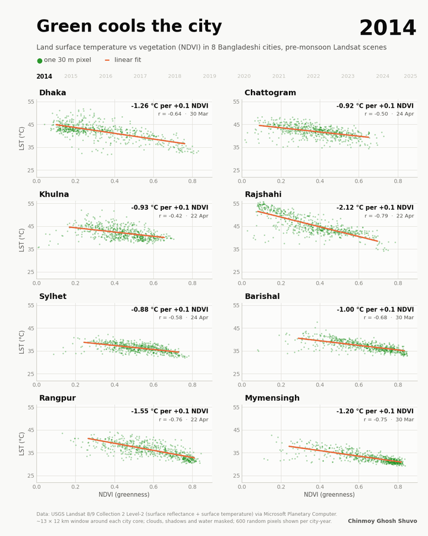
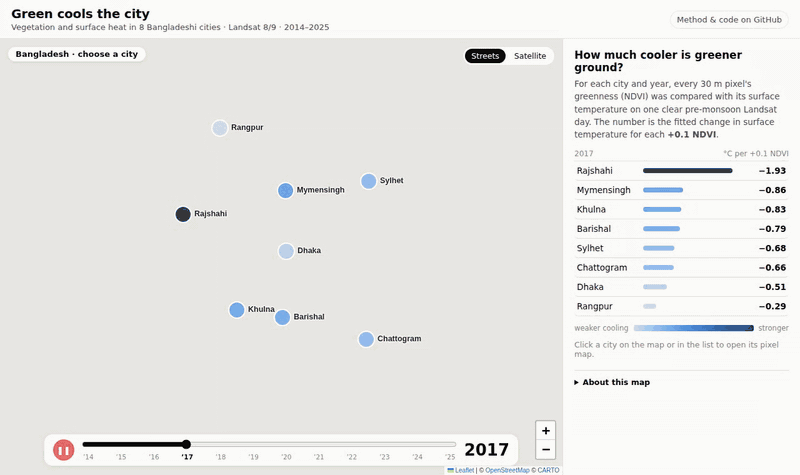
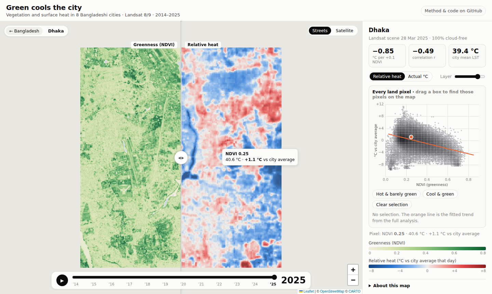
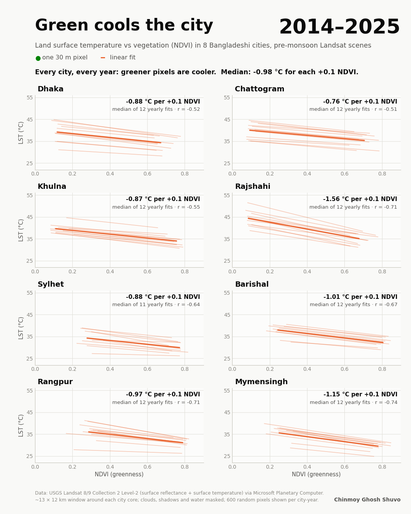
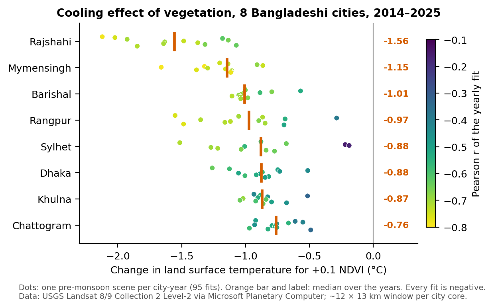
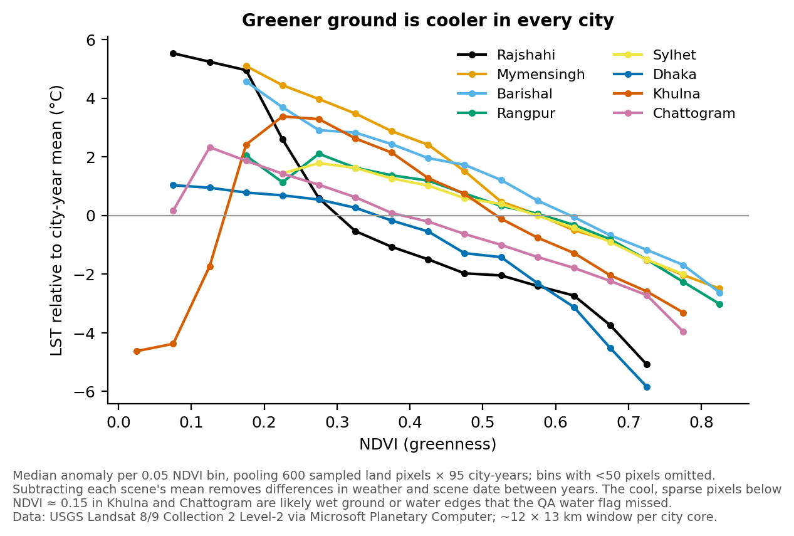
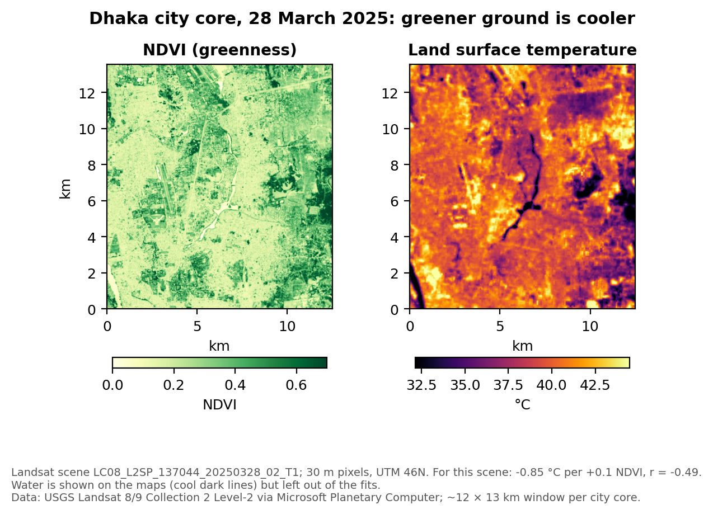

# Green Cools the City: Vegetation and Surface Heat in 8 Bangladeshi Cities, 2014–2025

**Personal portfolio project (individual work)** · Chinmoy Ghosh Shuvo · September 2026

## Summary

Does urban greenery measurably cool the ground in Bangladesh's cities? For each of the eight divisional cities, and for every year from 2014 to 2025, I took the clearest pre-monsoon Landsat 8/9 scene and compared vegetation (NDVI) with land surface temperature (LST) pixel by pixel at 30 m. **All 95 city-year fits are negative:** in every city and every year, greener pixels are cooler. Across all fits, the median effect is **−0.98 °C of surface temperature for each +0.1 NDVI**. The effect is strongest in Rajshahi (median −1.56 °C) and Mymensingh (−1.15 °C), and weakest in Chattogram (−0.76 °C). The result is an animated small-multiples chart, an interactive version, and the full reproducible pipeline.

*Live interactive map: [chinmoyghoshshuvo.github.io/green-cools-the-city-bangladesh/](https://chinmoyghoshshuvo.github.io/green-cools-the-city-bangladesh/) · Full video: [`images/green-cools-the-city.mp4`](images/green-cools-the-city.mp4) · Interactive version with year slider: [`interactive/green_cools_the_city_interactive.html`](interactive/green_cools_the_city_interactive.html) (download and open in a browser)*

## Interactive map

**Open the live map: [chinmoyghoshshuvo.github.io/green-cools-the-city-bangladesh/](https://chinmoyghoshshuvo.github.io/green-cools-the-city-bangladesh/)**

The map opens on all eight cities, coloured by how much cooler greener ground was in the chosen year. Clicking a city opens its 30 m pixel map:

- **Swipe** the divider to compare greenness (NDVI, left) with heat (right) over the same streets.
- **Year slider and play button** step through 2014–2025.
- **Relative heat / Actual °C.** Relative heat is a pixel's temperature minus the city's mean land temperature that day, so years with different weather can be compared. Actual °C is the raw land surface temperature.
- **Linked scatter.** Every land pixel is plotted as NDVI against temperature. Pointing at (or tapping) the map marks that pixel on the scatter. Dragging a box on the scatter, or using the "Hot & barely green" preset, fades every other pixel on the map and reports the land area selected.
- **Streets or satellite basemap**, and shareable links: `#Dhaka/2024/abs` opens Dhaka, 2024, actual °C.

The page is plain HTML and JavaScript in [`docs/`](docs/) (Leaflet 1.9.4 is included in `docs/lib/`), published with GitHub Pages from that folder. To open it on your own computer, run `python -m http.server` inside `docs/` and visit http://localhost:8000; opening `index.html` directly will not load the data.

## Study area

The city cores of **Dhaka, Chattogram, Khulna, Rajshahi, Sylhet, Barishal, Rangpur and Mymensingh**. Each is a fixed 0.12° × 0.12° window (about 12 × 13 km) around the city centre. The windows are in [`data/city_windows.geojson`](data/city_windows.geojson).

## Data

| Dataset | Use | Resolution |
|---|---|---|
| Landsat 8/9 Collection 2 Level-2 (red, NIR, surface temperature band, QA_PIXEL) via the Microsoft Planetary Computer STAC API | NDVI, LST and cloud and water masking | 30 m |
| 95 scenes (80 Landsat 8, 15 Landsat 9), one per city-year, dated 22 February to 8 May | Pre-monsoon hot season, 2014–2025 | — |

Sylhet 2016 has no usable scene, which leaves 95 of the 96 city-years.

## Method

1. **Scene choice.** Searched scenes from 20 February to 10 May with less than 40% cloud. The chosen scene had to be at least 85% clear over the city window, and among those the one closest to about 5 April was taken. If no scene reached 85%, the clearest was used, down to a minimum of 50%.
2. **NDVI and LST.** Applied the USGS scale factors: reflectance = DN × 0.0000275 − 0.2; LST (°C) = DN × 0.00341802 + 149.0 − 273.15. NDVI = (NIR − Red) / (NIR + Red).
3. **Masking.** Removed fill, dilated cloud, cirrus, cloud and cloud shadow (QA_PIXEL). Water flagged in the QA band was also removed for the fits, and only land pixels with 0 < NDVI < 1 and 5–70 °C were kept (101,622–190,968 pixels per city-year).
4. **Fit.** A linear regression of LST on NDVI for each city-year gives the slope (°C per unit NDVI, reported per +0.1 NDVI) and Pearson r. 600 random pixels per city-year were saved for plotting.
5. **Outputs.** A matplotlib animation (MP4 and GIF) that steps through the years and ends on all yearly fits with their median, and a Plotly interactive version with a year slider.

## Results

| City | Median °C per +0.1 NDVI | Range over years | Median r |
|---|---|---|---|
| Rajshahi | −1.56 | −2.12 to −1.07 | −0.71 |
| Mymensingh | −1.15 | −1.66 to −0.86 | −0.74 |
| Barishal | −1.01 | −1.11 to −0.57 | −0.67 |
| Rangpur | −0.97 | −1.55 to −0.29 | −0.71 |
| Sylhet | −0.88 | −1.51 to −0.19 | −0.64 |
| Dhaka | −0.88 | −1.26 to −0.51 | −0.52 |
| Khulna | −0.87 | −1.04 to −0.51 | −0.55 |
| Chattogram | −0.76 | −0.97 to −0.49 | −0.51 |

*Source: [`data/city_year_summary.csv`](data/city_year_summary.csv).*

- **Consistent direction:** all 95 slopes and all 95 correlations are negative, and the median r is −0.64.
- **City differences:** Rajshahi shows the steepest cooling and Mymensingh the most consistent fits (median r −0.74). Chattogram, Dhaka and Khulna have the gentlest slopes and the weakest correlations (median r −0.51 to −0.55).
- **Year-to-year variation** in each city is large, because each year uses a single scene with its own weather and date.

**Caveats:** the relationship is a correlation, not a measured causation, because NDVI also tracks building density and nearness to water. Each city-year is one scene, so mean LST is not comparable between years or cities; only the slopes are. A few scenes are only 60% clear (Chattogram 2019, Sylhet 2019 and 2020), and Sylhet 2018–2019 give weak fits (r ≈ −0.15 to −0.17). LST is the temperature of the ground surface, not the air. In the interactive map, water is approximated as pixels with NDVI ≤ 0 (the analysis used the Landsat QA water flag), so its pixel counts differ slightly from the analysis; the trend lines and numbers shown come from the analysis.

## Code

- [`code/gcc_lib.py`](code/gcc_lib.py): searches the Planetary Computer, picks and masks the scenes, writes the NDVI/LST GeoTIFFs and the summary and pixel-sample CSVs. Needs GDAL. Set `OUT` at the top, then run `run(list(CITIES), range(2014, 2026))`.
- [`code/animate.py`](code/animate.py): builds the MP4, GIF and final frame. Run `python code/animate.py data images` (it writes the original file names, e.g. `green_cools_the_city.gif`).
- [`code/interactive.py`](code/interactive.py): builds the interactive Plotly page. Run `python code/interactive.py data interactive`.
- [`code/build_webmap_data.py`](code/build_webmap_data.py): converts the 95 GeoTIFFs into the map's data files. Each city gets one fixed ~30 m Web Mercator grid so every year lines up pixel for pixel; NDVI and LST are stored as one byte each and gzipped (about 22 MB in total). Run `python code/build_webmap_data.py <raster folder> data/city_year_summary.csv docs/data`.
- [`viz/make_figures.py`](viz/make_figures.py): the three analysis figures above.

The 95 two-band GeoTIFFs (NDVI and LST, about 100 MB in total) are not included. `gcc_lib.py` recreates them, and one example (Dhaka 2025) is in [`data/rasters/`](data/rasters/).

## Tools

Python (GDAL, rasterio, NumPy, pandas, matplotlib, Plotly, imageio) · Microsoft Planetary Computer STAC API · QGIS · JavaScript with Leaflet (web map; Esri basemaps) · GitHub Pages

## Contact

Chinmoy Ghosh Shuvo · Open to collaboration and knowledge sharing. Feel free to reach out on [LinkedIn](https://www.linkedin.com/in/chinmoyghosh034).
